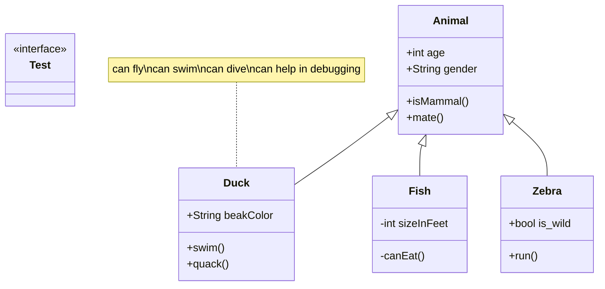

# gosk - Go Semantic Kernel

> ⚠️ Please note that gosk is currently in a very early stage of development. As such, there may be bugs or incomplete features. Your understanding and patience are much appreciated. I warmly welcome any [contributions](#contributing), suggestions, or bug reports to help improve the module.

Go Semantic Kernel (gosk) is a Go module inspired by the Microsoft Semantic Kernel, originally designed to facilitate the integration of OpenAI's API and large language models in C# and Python applications. **`gosk`** extends this functionality to the Go programming language, thereby empowering Go developers to define and utilize AI skills and functions with ease, bringing the power of OpenAI's advanced language models to a broader programming community.

Using prompt engineering, gosk enables developers to define AI skills and functions, which can then be easily utilized within their applications.

See also: <https://github.com/microsoft/semantic-kernel>

## Installation

To install the `gosk` module, use the following command:

```bash
go get github.com/mfmayer/gosk
```

## Usage

`gosk` comes with a few exemplary `Skills`. Each `Skill` can contain one or more `SkillFunctions`.

A `SkillFunction` is called with input `Content` and returns a response `Content`.

```go
package main

import (
	"fmt"
	"testing"

	"github.com/mfmayer/gosk"
)

func main() {
	kernel, err := gosk.NewKernel()
	if err != nil {
		t.Fatal(err)
	}
	skill, err := kernel.ImportSkill("FunSkill")
	if err != nil {
		t.Fatal(err)
	}
	sf := skill["Joke"]
	response, err := sf("Engineer", "")
	if err != nil {
		t.Fatal(err)
	}
	fmt.Printf("%v\n", response)
}
```

In the example above, a new Semantic Kernel is created, and a skill named "FunSkill" is imported into it. This skill contains a function Joke which takes two arguments, a subject and an additional context (which is left empty in this example). It returns a joke related to the subject, in this case, an "Engineer".

The resulting joke is printed to the console. E.g.:

```bash
Why did the engineer install a doorbell on his desk?

Because he wanted to hear when opportunity knocked!
```

## Skills and Functions

Skills and their functions 



## Contributing

Contributions to the gosk project are welcome! If you have a bug to report, a feature to suggest, or a patch to submit, please feel free to use the GitHub issue tracker or submit a pull request.

## License

The gosk module is open source software released under the MIT License (like semantic kernel from microsoft). For more details, see the LICENSE file in the repository.