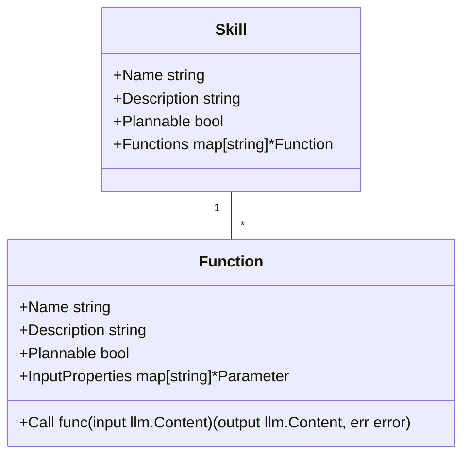

# gosk - Go Semantic Kernel

> ⚠️ Please note that gosk is currently in a very early stage of development. As such, there may be bugs or incomplete features. Your understanding and patience are much appreciated. I warmly welcome any [contributions](#contributing), suggestions, or bug reports to help improve the module.

Go Semantic Kernel (gosk) is a Go module inspired by the Microsoft Semantic Kernel, originally designed to facilitate the integration of OpenAI's API and large language models in C# and Python applications. **`gosk`** extends this functionality to the Go programming language, thereby empowering Go developers to define and utilize AI skills and functions with ease, bringing the power of OpenAI's advanced language models to a broader programming community.

Using prompt engineering, gosk enables developers to define AI skills and functions, which can then be easily utilized within their applications.

See also: <https://github.com/microsoft/semantic-kernel>

## Installation

To install the `gosk` module, use the following command:

```bash
go get github.com/mfmayer/gosk
```

## Basics

**`gosk`** defines **Generators**, **Skills** and **Skill-Functions**. Each **Skill** can have multiple **Functions** that can use **Generators** and **Prompt Templates** to make use of large language models (LLM) like OpenAI's GPT models.

**`gosk`** comes with a few exemplary skills and generators, which can be easily supplemented with your own.

## Getting Started

**`gosk`** includes the exemplary [`fun`](pkg/skills/fun/) skill with the [`joke`](pkg/skills/fun/assets/joke/) function, which defines two input properties:

* The default input property as joke subject
* An optional `style` input property

The fun function can be used the following way (see also [cmd/joke/main.go](cmd/joke/main.go)):

```go
package main

import (
	"fmt"

	"github.com/mfmayer/gosk"
	"github.com/mfmayer/gosk/pkg/gpt"
	"github.com/mfmayer/gosk/pkg/llm"
	"github.com/mfmayer/gosk/pkg/skills/fun"
)

func main() {
	kernel := gosk.NewKernel()
	kernel.RegisterGenerators(gpt.Register)
	kernel.RegisterSkills(fun.Register)
	functions, err := kernel.FindFunctions("fun.joke")
	if err != nil {
		panic(err)
	}
	input := llm.NewContent("dinosaur").With("style", "One-Liner, no question")
	response, err := kernel.Call(input, functions...)
	if err != nil {
		panic(err)
	}
	fmt.Println(response.String())
}
```

Explanation:
1) A new kernel is created and the `gpt` generator and `fun` skill are registered with it.
2) The `fun` skill's `joke` function is found and returned (with a path annotation `<skill>.<function>`).
3) The function input is created with:
   * subject as default input property: `dinosaur`
   * "style" input property: `One-Liner, no question`
4) Function is called and response printed.

The resulting joke is printed to the console. E.g.:

```bash
"I told my boss I couldn't come to work because a dinosaur was blocking my driveway, but he didn't believe me, guess he thinks it's a Bronto-lie-rus."
```

## Skills and Functions



## Contributing

Contributions to the gosk project are welcome! If you have a bug to report, a feature to suggest, or a patch to submit, please feel free to use the GitHub issue tracker or submit a pull request.

## License

The gosk module is open source software released under the MIT License (like semantic kernel from microsoft). For more details, see the LICENSE file in the repository.